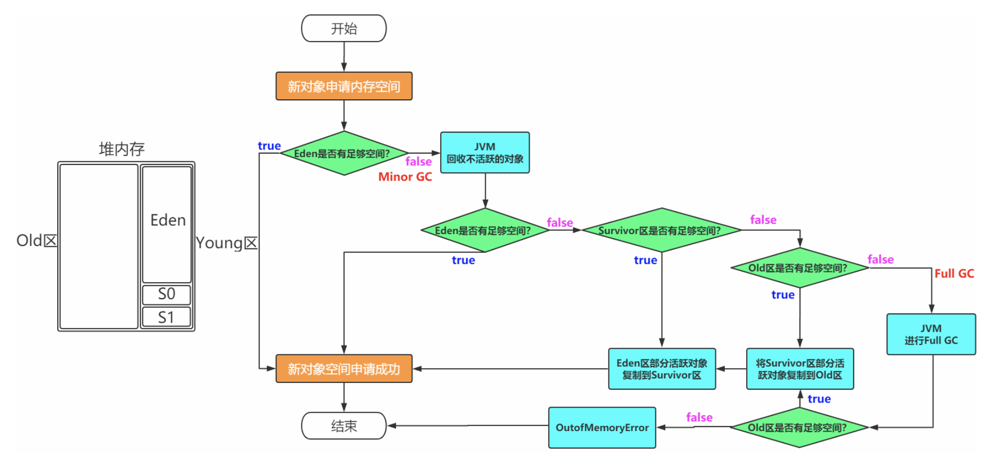

# java内存管理
## JVM类加载

    类加载机制
        装载 -> 链接（验证、准备、解析）-> 初始化
        就是虚拟机把Class文件加载到内存，并对数据进行校验、转换解析和初始化，形成虚拟机直接使用的java类型。
        装载:把class文件加载java虚拟机
        链接：
            验证。 对文件格式、元数据验证
            准备。 为类的静态变量分配内存
            解析。 从运行时常量池中的符号引用转换成直接引用
        初始化：
            执行init方法，为静态变量赋值，初始化静态代码块，初始化当前类的父类
    类加载器的种类
        BootStrap ClassLoader 启动类加载器 加载最核心rt包的class
        ExtClassLoader 扩展类加载器 加载jre目录下的class
        Application ClassLoader 系统类加载器 加载classpath下所有的class
        custom ClassLoader  自定义类加载器
    
    双亲委派机制
        指的是一个类加载时，先会向上传递看自己的父类加载器有没有加载过，没有加载过才委派子类加载

        好处是避免了重复加载以及核心类被篡改

    怎么打破双亲委派
        1.复写classLoader类，在方法中不委托父类加载，子类直接加载
        2.SPI 利用反射机制实现
        3.OSGI 热部署 热更新
## JVM内存结构

    内存结构中包含哪些区域
        栈区、堆区、方法区、本地方法区、程序计数器

    堆内存结构划分
        新生代（Young区）和老年代（Old区）， 分配比例为1:2
        新生代内有分为Eden区，Survivor0区，Survivor1区。内存分配比例为8:1:1

        因为绝大多数情况下，对象分配内存后再第一次垃圾回收时就已经没有引用指向了

## JVM垃圾回收

    垃圾回收的时机:
        1.Eden区不足,MinorGC
        2.老年代空间不够，Full GC
        3.方法区不够
        4.system.gc()

    如何确定一个对象是垃圾
        通常有两个方法 
            1.引用计数法，当一个对象没有任何对象引用，那就是应该被回收的对象。但如果两个对象相互引用，则没办法回收
            2.可达性分析法。以GC Root对象为起始点，开始乡下寻找，看某个对象是否可达。
                能作为GC Root的对象:类加载器、Thread、虚拟机栈的本地变量表，static成员，本地方法栈变量等。
    
### 垃圾回收算法
    常见的垃圾回收算法
        1.标记清除法
            把堆中所有的对象扫描一遍，找出需要回收的对象，并标记出来。清除掉别标记需要回收的对象，释放出对应的内存空间。
            缺点:
                标记清除这两个过程都比较耗时，效率低。
                标记清除后会产生大量不连续的内存碎片，空间碎片太多会导致以后需要分配较大对象时，没有连续内存而再次出发再一次gc

        2.标记复制法
            将内存划分为两块相等的区域，每次只使用其中一块。当一块内存用完了，把仍存活的对象复制到另一块上，把使用过的内存空间一次清除掉。
            缺点:
                空间利用率低
        3.标记整理法
            标记整理和标记清除类似，是把所有存活的对象，向一端移动。然后清理掉端边界以外的内存。
    
    堆内存垃圾回收采用分代收集算法
        young区采用复制算法，本身young区生命周期比较多，复制效率比较高
        old区：标记清除或标记整理。  old区对象存活时间比较长。

    垃圾收集器
        serial
            适用于新生代的单线程收集器
            缺点:在进行垃圾回收时会暂停其他线程
            算法:复制清除
        serial old
            serial收集器的老年代版本
            算法:标记整理算法

        ParNew
            serial收集器的多线程版本,适用于新生代
            优点:多cpu下，比serial效率高
            缺点:收集过程暂停所有应用程序线程
            算法：复制清楚算法

        CMS
            作用于老年代的的采用标记清除的算法。除了初始标记、重新标记外，的标记和清除都可以和用户线程一起并发执行。
            优点:并发手机、低停顿
            缺点:产生大量随便、并发阶段会降低系统吞吐量

        G1
            重新对java堆内存进行划分成多个大小相等的独立区域region。在垃圾回收时，对每一个region进行单独回收。

## JVM常用命令
    jps 查看java进程
    jinfo 实时查看和修改jvm参数

    jstat
        1.查看虚拟机性能统计
        2.查看类装载信息
            jstat -class PID 1000 10 查看某个java进程的类装载信息，每1000毫秒输出一次，共输出10次
        3.查看垃圾收集信息
            jstat -gc PID 1000 10
    
    jstack
        查看java堆栈信息
        jstack PID
    
    jmap 查看堆内存快照